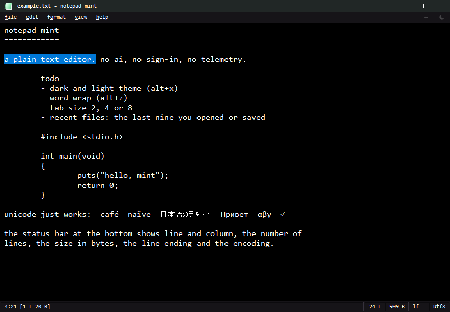
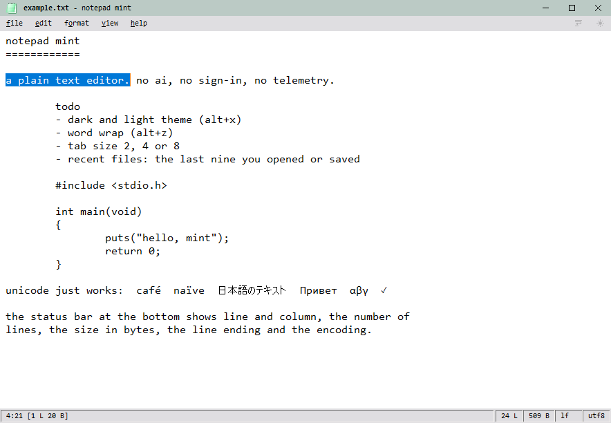

# notepad mint

a free, dark replacement for `notepad.exe`: plain text only. no ai, no sign-in, no telemetry.

| dark (the default) | light |
|---|---|
|  |  |

## download

from the [latest release](https://github.com/yuruko/notepad-mint/releases/latest):

- `notepad-mint-<version>-setup.exe`: the installer (installs to `program files (x86)\notepad-mint`; start menu shortcut, optional desktop shortcut, uninstaller in *installed apps*; your settings are left alone when you uninstall)
- `notepad-mint-<version>.exe`: the standalone exe, nothing to install: put it anywhere and run it

one 32-bit exe (under 140 kb) runs on 32-bit windows, 64-bit windows and windows on arm. settings are in `%appdata%\notepad-mint\settings.ini`.

## what it does

- written in raw c and **32-bit x86 assembly**. no crt, no libraries, no `windows.h`: every win32 declaration is hand-written in `src/w32.h`
  (checked against the real sdk by `tools/layout_check`). the exe imports only kernel32 / user32 / gdi32 (everything else is loaded at run time).
- behaves like notepad (same menus, status bar and wording) plus:
  - **themes**: a dark theme (the default, mint accent `#9df5bd`) and a light one (a softer green accent `#2f7d58`); alt+x or the sun / moon button at the very right of the menu bar switches them; hover uses the accent, the caret is plain white / black;
    title bar (white / black over a soft accent tint), menu bar and status bar in the editor's font face at a fixed 11 px; classic style scrollbars in both themes' colours, 13 px thin;
  - **word wrap**: alt+z, or the button left of the theme button; hover either button for a moment and a tooltip says what it does and its key combo;
  - **tab size**: format > tab size: 2, 4 or 8 columns (4 by default), remembered, also used when printing;
  - **recent files**: file > recent keeps the last 9 files you opened or saved (newest first, press 1-9), shared by all open windows; "clear list" at the bottom empties it;
  - **whole-word search**: find, previous / next, replace and replace all share the same word boundaries; remembers the option alongside match case and wrap around;
  - **log files**: opening text beginning with `.LOG` appends the local time and date at the end, ready to type the next entry; one undo removes the entry;
  - **safer saves**: writes and flushes a temporary file before replacing the original, detects lossy legacy encoding conversions, and asks before overwriting a file whose size or modification time changed outside the app;
  - **selection printing**: select text before opening print to enable printing just that selection;
  - **text runs to the edge**: an 8 px margin around the text (4 px on top), but text that is scrolled out of it runs to the very edge of the editor, no blank frame; the row that is only partly in view at the bottom is drawn, cut off at the edge;
  - **status bar**: compact (`12:5`, `5 L`, `124 B`, `crlf`, `utf8 bom`), the lines, bytes and line ending panels grow and shrink with their text, never cut off; with a selection it shows the lines and bytes selected (`162:54 [5 L 54 B]`); click the line ending / encoding panels to change them;
  - **zoom**: ctrl+plus / ctrl+minus / ctrl+0, ctrl + mouse wheel (8-48 pt); resizing or changing zoom scrolls the caret into view while keeping the selection and undo history;
  - **scrolling**: mouse-wheel and scrollbar scrolling keep the cursor in place; keyboard navigation returns to that position before moving it, including wrapped text and shift selections;
  - **font preview**: one line at the selected size, from 7 to 100 pt: "sphinx of black quartz, judge my vow. 0123456789"; face, bold and italic update live;
  - **encodings and line endings**: utf-8 (with or without bom), utf-16 le / be, legacy code pages, reopen with another encoding; windows / unix / classic mac line endings; right-to-left toggle; unicode control characters; per-monitor dpi;
  - **drop files or folders** on the window to insert their paths at the caret, one per line (shift+drop opens the files instead); a selected line break shows as a small highlighted block, so empty lines and line ends inside a selection can be seen;
  - **ctrl+k** clears the current line (ctrl+z brings it back); ctrl+backspace / ctrl+delete delete a word;
  - an unsaved document is called `mint-XXXX` (4 characters of 0-9 a-z from the date and time) instead of "untitled"; "modified" means *different from the file* (type and delete again, or undo back, is not a change);
  - **command line**: `notepad-mint /p file` prints the file on the default printer without a dialog and exits (like notepad's `/p`); a plain `notepad-mint file` opens it;
  - the window can be made small: down to 320 x 140 px.

## small, fast, clean

- **small**: the whole editor is one exe under 140 kb (the hard limit is 300 kb). small icon images are packed losslessly as png (`tools/pack_icon.py`), the 256 px icon uses a compact palette (`tools/shrink_icon.py`), and release builds combine size optimization with link-time optimization (`/O1 /GL /LTCG`). no crt, no libraries, no third-party code: the imports are kernel32 / user32 / gdi32 and nothing else (checked on every build by `tools/check_imports.ps1`).
- **fast**: it uses the stock windows edit control, so typing and scrolling are as quick as notepad's, and big files open quickly:
  - opening converts the file once (no size query pass), reuses successful utf-8 detection validation, and gives back what multi-byte text did not need; saving converts utf-8 in one pass, writes straight from the editor's own buffer (no 40 mb copy of a 20 mb file) and skips the line-ending rewrite when the text already is crlf;
  - nearby caret moves update logical line / column from only the moved text, and crlf byte sizing skips an unused newline scan; on a text over a million characters, the line / byte counts follow when typing pauses instead of on every key;
  - selection printing copies only the selected range into its snapshot;
  - find / replace uses linear-time KMP matching, including backwards searches; `memcmp` compares a dword at a time, `memmove` copies dwords backwards too, and `mp_count_lf` (line counting) is sse2 assembly;
  - dirty-state comparisons are cached until the text changes, and settings skip unchanged values and bound retries when their file is locked;
  - native text and custom partial rows are painted into one offscreen frame and presented together, keeping existing text visible while multilingual glyphs are drawn;
- **clean**: zero warnings at `/W3`; `tools/layout_check` proves every struct, constant and function in the hand-written `src/w32.h` against the real windows sdk; 457 unit checks (including randomized search cases and file failure injection), 38 print checks and over 1,000 gui checks drive the real exe on a private desktop (nothing shows on your screen): `tools\verify.bat ui`. icon packing verifies identical pixels and native Windows rendering.

## status

every menu item works: file (new, new window, open, recent, save, save as, page setup, print, exit), edit (undo ... select all, time / date, find, find next / previous,
replace, go to, clear line), format (word wrap, font, tab size, line ending, encoding), view (zoom, status bar, theme), help (the about box links to yuru.be). find / replace, go to, font, encodings, about and help
are our own dark / light dialogs; open, save as, print and page setup are the native windows dialogs (they follow windows' own dark / light mode, not the app theme). the encoding and line ending of a file are set from the
format menu or the status bar, not in the save as dialog.

how each part was verified, and what is still open, is in `NOTES.md` (status) and `TODO.md`. the native editor has one undo level and loads large files synchronously. tabs, session recovery and custom print headers are not implemented. whole-word boundaries conservatively treat supplementary unicode characters (including emoji) as word characters; embedded nul characters are converted to spaces on load, and mixed line endings are normalized to the majority style.

## build

needs visual studio's c++ build tools (x86 target) and the windows sdk (python 3 for the layout check).

    build.bat                 release build -> build\notepad-mint.exe (zero warnings at /W3)
    build.bat dbg             debug build (symbols, build\dbg.log tracing)

`build.bat` looks for `vcvarsamd64_x86.bat` of visual studio 18 community and falls back to `vswhere`.

## source map

| responsibility | source |
|---|---|
| entry, commands, window layout and document flow | `main.c` |
| settings, recent files, dirty state and status calculations | `prefs.c`, `app_state.c`, `app_status.c` |
| native editor layout/painting, caret geometry and logical text helpers | `edit.c`, `edit_caret.c`, `edit_text.c` |
| palette, fonts/DPI, drawing, buttons and dialog lifecycle | `ui.c`, `button.c`, `dialog.c` |
| menu data/interaction, title strip, status panels and scrollbars | `menu_defs.c`, `menu.c`, `frame.c`, `status.c`, `sbar.c` |
| document encoding/safe writes, search and pagination | `doc.c`, `search.c`, `print.c` |
| find, font, file/encoding and help/about dialogs | `find.c`, `fontdlg.c`, `filedlg.c`, `about.c` |
| shared declarations and CRT-free runtime | `mp.h`, `w32.h`, `util.c`, `rt.asm` |

Private headers describe the small contracts between extracted modules. `ui_probe.c` and the existing editor probes compile only with test instrumentation enabled; release builds expose no probe messages.

## installer and release

    tools\installer.bat [version]    build\notepad-mint-<version>.exe (standalone) + build\notepad-mint-<version>-setup.exe (NSIS installer)

needs [NSIS 3](https://nsis.sourceforge.io/) (`makensis` on the path, in program files, or the portable zip unpacked to `build\nsis-3.10`); the installer script is `installer\notepad-mint.nsi`.

release downloads include `SHA256SUMS.txt`. the manual release workflow requires an existing tag and checks out that exact tag before building.

the release pipeline is `.github/workflows/release.yml`: push a tag `v1.2.3` (keep the version in step with `FILEVERSION` in `src/notepad_mint.rc`) and github builds the exe, checks its version, warnings, size, imports and SDK declarations, runs unit/print tests, builds the installer and publishes both files with checksums.

    git tag v1.0.0 && git push origin v1.0.0

## checks

    tools\verify.bat          release build + warning/size/version/import checks, SDK layout, unit/print tests, smoke test
    tools\verify.bat ui       ... plus the message-driven gui tests (tests\ui\ui_test.ps1; private desktop, nothing shows)
    tools\verify.bat frame    ... plus the title strip test (tools\frame_test.ps1: real mouse input, it moves the mouse for a few seconds)

github ci for every push is switched off (the maintainer builds and tests locally with `tools\verify.bat ui`). the older build workflow is parked as `.github/workflows/build.yml.disabled`; it has fewer checks than current local/release verification and a nonfatal smoke test, so update it before enabling it. only the release workflow runs, on version tags.
`tools\` also has `pw_shot.ps1` (screenshot on a private desktop: nothing shows; `-File`, `-Theme`, `-Sel`, `-HScroll`, `-VScroll`), `shot.ps1` (launch, send keys / a menu command / a mouse drag, screenshot on the real desktop), `cc.bat` (compile-check one file), `probe.bat` (experimental build), `flicker_test.ps1` (counts flicker frames while the window is resized: it shows the exe on your real desktop for a few seconds, takes no focus and sends no input) and `make_icon.ps1` (builds the icon).

## notes

the app icon is the real notepad icon recolored mint by `tools/make_icon.ps1` (it reads it from the local `notepad.exe`),
so it is derived from microsoft's artwork. there is no license file yet.
